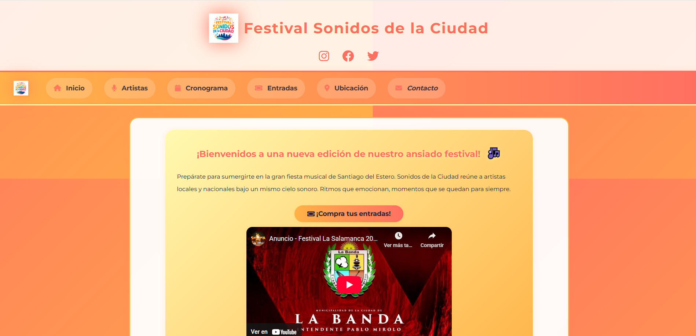
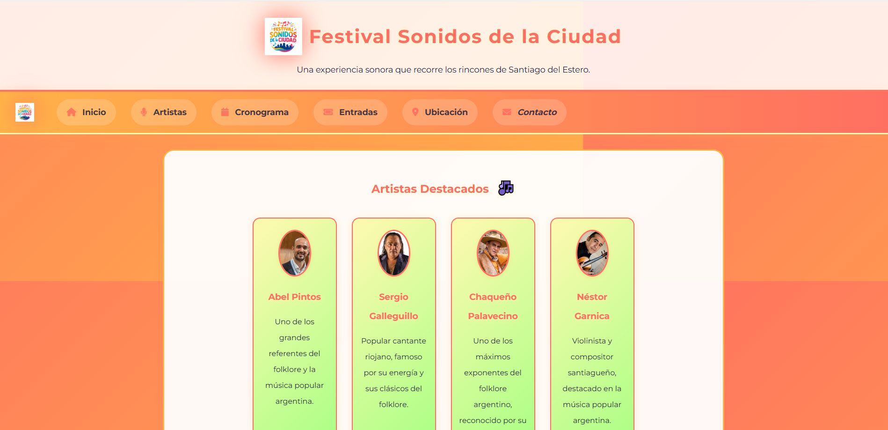

# 🎵 Festival Sonidos de la Ciudad

Sitio web oficial del Festival Sonidos de la Ciudad - Una experiencia sonora que recorre los rincones de Santiago del Estero.

## 🌐 Demo en Vivo

🔗 **[Ver sitio web](https://sonidos-de-la-ciudad-fest.netlify.app/)**

---

## 📸 Capturas de Pantalla

### Página de Inicio

### Página de Artistas

---

## 🛠️ Tecnologías Utilizadas

### Frontend
- **HTML5** - Estructura semántica
- **CSS3** - Estilos personalizados con animaciones
- **JavaScript Vanilla** - Interactividad y validaciones

### Librerías y Frameworks
- **Font Awesome 6.4.0** - Iconografía
- **Google Fonts (Montserrat)** - Tipografía

### Backend (PHP)
- **PHP** - Procesamiento de formularios

### Diseño
- Paleta de colores personalizada
- Animaciones CSS
- Diseño responsive mobile-first

### Deployment
- **Netlify** - Hosting y despliegue continuo
- **Git/GitHub** - Control de versiones

---

## ✨ Características

- ✅ Diseño responsive (móvil, tablet, desktop)
- ✅ Animaciones fluidas y efectos visuales
- ✅ Formulario de contacto funcional
- ✅ Sistema de compra de entradas con validación
- ✅ Sorteo interactivo
- ✅ Integración con Instagram
- ✅ Reproductor de audio embebido
- ✅ Mapa de ubicación
- ✅ Cronograma detallado

---

## 👨‍💻 Autor

**Fernando Villarroel**
- GitHub: [@FernandoAVillarroel](https://github.com/FernandoAVillarroel)
- LinkedIn: [Fernando Villarroel](https://www.linkedin.com/in/fernando-villarroel-a635a431b/)

---

© 2025 Festival Sonidos de la Ciudad
